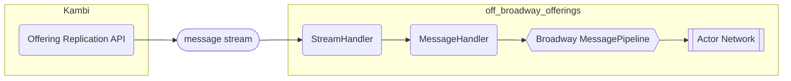
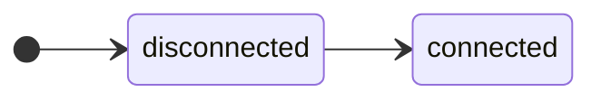
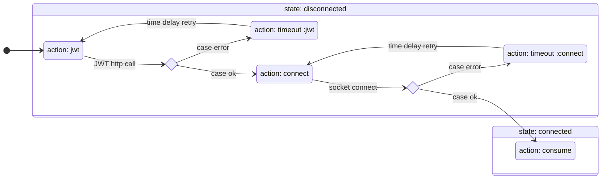
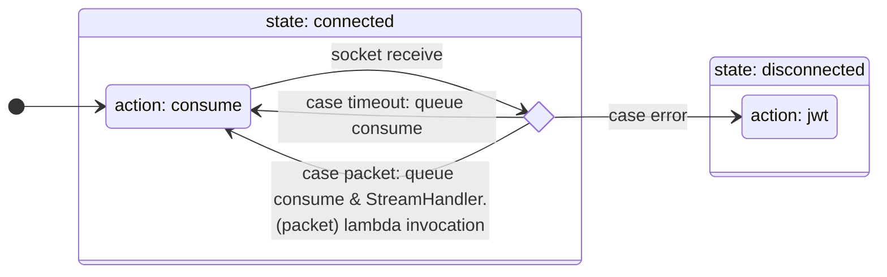
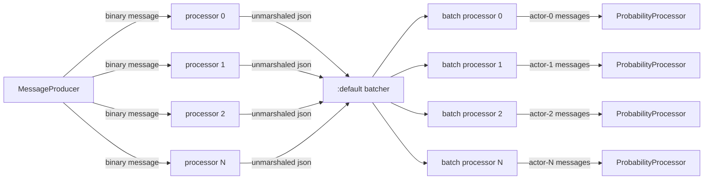
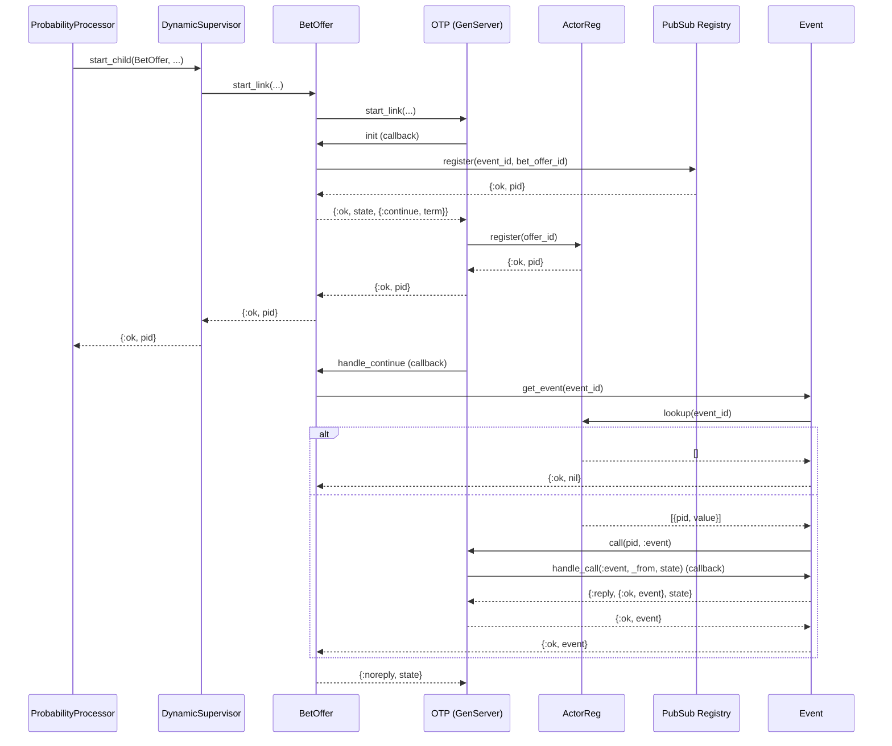
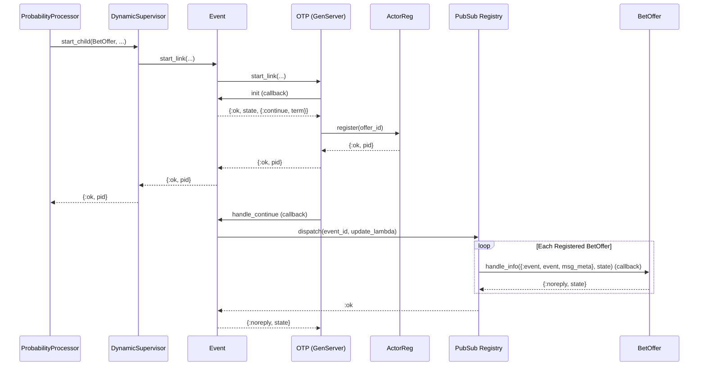
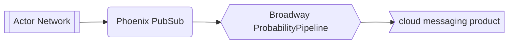
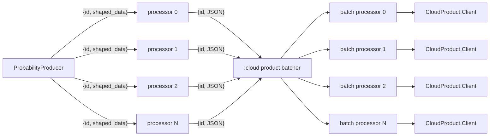

# Off-Broadway Offerings
> [!NOTE]
> ☝️ NB: This is a system that I designed, implemented, and released to production for a major provider in the online gambling space. The intent of this repository is to share techniques used for handling a real-time, low latency (compressed) TLS/TCP socket data stream and how to establish an actor network for *reactively* handling real-time data stream events.  Of particular note is the approach for identifying message boundaries from the raw socket data, which while in this case, happens to be implemented in *Elixir*, should certainly be achievalbe in other languages assuming they have higher-order function capability.
>
> *All client-specific code has been **removed**.*  I've substituted client-related code with `~redacted~` treatment, but this shouldn't detract from your ability to grok the overall concepts.  Feel free to reach out with any questions.

An [Elixir](https://elixir-lang.org/) ([off-broadway](https://hexdocs.pm/broadway/introduction.html#non-official-off-broadway-producers)) application that consumes a Kambi [Offering Replication API](https://ctn-api.kambi.com/offering-gate/v1/docs/#/docs/intro/overview) data stream and feeds it to a [Broadway](https://elixir-broadway.org/) pipeline.  The events are then processed by way of a dynamic actor network.

It is within the actor network where arbitrary, reactive business logic runs.

## Processing Internals
`off_broadway_offerings` is an [OTP](https://www.erlang.org/doc/system/design_principles.html) application with numerous levels of supervision trees.  It's designed to be error resilient when applicable and to internally manage component isolation.  For a typical example, if we should experience a networking hiccup, the entire application will not grind to a halt, but rather, the connection will be reesatblished and the app will self-heal.  That said, there are several processing internals of note, as outlined below.

### The Connection component: a [gen_statem](https://www.erlang.org/doc/man/gen_statem.html) state machine
The ORA feed requires two steps to start the message stream, both of which needing client certs for authentication.  The first step is to retrieve a JWT followed by using said JWT to establish a TLS/TCP socket connection.  Once the socket connection has been established, the session gets initialized and the real-time offerings message stream starts.

#### Connection states

#### Disconnected state internals

#### Connected state internals

Once connected, [`rcv`](https://www.erlang.org/doc/man/ssl.html#recv/3) calls on the socket with results of *packet* (ie, *data* from the socket buffer) or *timeout* are immediately followed by messaging the process itself to invoke another `consume` call.  This enables the module to be responsive to other messages it may have received in its mailbox (gen_statem is actually a gen_server abstraction).

### Broadway Message pipeline: reliably organizing the real-time ORA data stream
Identifying compressed message boundaries (and doing so performantly) is only part of the challenge of making use of this data feed.  It's been observed that despite TCP ordering guarantees, messages in the ORA feed are not guaranteed to arrive in a logical order.  I *am* confident at one point they were in order, but if you think about the context for which they're being generated, it starts to make more sense that the onus of organization is on the client.  I speculate that there's some sort of stability threshold required of an entity prior to it being shipped; said differently, if an entity is the subject of a barrage of updates, it simply doesn't make sense to ship it until that volatility has settled.  Meanwhile, more granular messages associated to the entity are not subject to the same constraints and are thusly sent over the wire to downstream clients (albeit with *higher* offset values, ie, logically out of order).  Fortunately for us, Broadway makes organizing all of this data rather simple.

Our sourcing of Broadway data is *slightly* unconventional with regard to what's typically described as its intended use-case, that of *pulling* data from sources.  Broadway producers, the *entry* point to Broadway pipelines, have an internal buffer that can have data *pushed* to; in this case, we push data to the `MessageProducer` from the `MessageHandler` (which, in turn, received data from the `StreamHandler`).  The `MessageProducer` maintains an internal state that is kept aware of what stage the messages being provided happen to be in: `snapshot` for bootstrap, `replay` when from an offset, and `realtime` when real-time; this extra meta information is passed along with the message in order to surface that bit in case downstream business logic would need it.  It's worthy of note that it's the `MessageHandler`'s responsibility to assign the current date-time prior to passing the data along to the `MessageProducer`.

The next stage *after* `producer` in a Broadway pipeline is that of `processor`.  Our processor configuration is the first stage to utilize concurrency.  It's got a very simple, but very important role of unmarshaling the message (from raw binary) and assigning the actor ID for which related messages will be batched.  The choice to unmarshal the messages in the processor was strategic: don't tie up the datastream consuming process with any unnecessary work, but rather distribute that work amongst the machine's cpu cores (ie, configured processor concurrency count).

Batching is the (*optional*) final stage of a Broadway pipeline and is where we logically dispatch in bulk for actor network processing (also making use of concurrency).  The `ProbabilityProcessor` receives batches of messages respective to an actor.  Its first duty is to sort the given messages by `offset`, thusly restoring logical order as presented in the entity models.  Once sorted, the actor messages are processed for create, update, and delete actions.  Batching gets triggered either by size or time threshold.

### Dynamic Actor network: reactive business logic by way of messaging
The `ProbabilityProcessor` can be thought of as a proxy to the actor network.  It relies heavily on the Elixir [Registry](https://hexdocs.pm/elixir/1.13/Registry.html) primitive and with the exception of create and delete handling, is entirely non-blocking. `Registry`'s design provides optimized lookup and assignment at the expense of *unregistering*, which [can be delayed](https://hexdocs.pm/elixir/1.13/Registry.html#module-registrations); we ensure unregistering by *tight-looping* a subsequent [lookup](https://hexdocs.pm/elixir/1.13/Registry.html#lookup/2), only returning once the call results in an empty value (in practice this takes place so quickly that it's unobservable, but Kambi will, on occasion, send deletes immediatly followed by creates for the same entity so ensuring delete is *required* in order to maintain proper actor state).

There are currently two types of actors in the network (both implemented as [GenServer](https://hexdocs.pm/elixir/1.13/GenServer.html)s): `Event` and `BetOffer`.  Per the message entity model, [Event](https://ctn-api.kambi.com/offering-gate/v1/docs/#/schemas/messages/event/event.json)s are *unaware* of their associated [BetOffer](https://ctn-api.kambi.com/offering-gate/v1/docs/#/schemas/messages/betOffer/betOffer.json)s and due to the async nature of the data stream, BetOffers *may* be processed in the system *prior to the actual existence* of their associated Event actors.  Fortunately for us, coordination of both scenarios isn't terribly difficult to deal with thanks again to strategic use of Elixir's `Registry`.  Relying on process instantiation on the [`BEAM`](https://en.wikipedia.org/wiki/BEAM_(Erlang_virtual_machine)) being atomic, both actor types' start sequences utilize a [`PubSub`](https://hexdocs.pm/elixir/1.13/Registry.html#module-using-as-a-pubsub) Registry feature.  Outlining the `BetOffer` sequence first will provide more context when looking at the `Event` starting sequence.

#### BetOffer actor initialization

That's quite a bit to unpack, but the particular things of note are:
* In its `init`, the BetOffer registers itself in the `PubSubReg` to receive notifications from its associated Event when *that* actor receives updates.
* The `init` callback response contains a `continue` instruction, which gets priority over any other messages that may have already arrived in the BetOffer's mailbox.
* The subsequent `handle_continue` *attempts* to retrieve the associated Event; if the event exists, pertinenat event attributes are stored in the BetOffer actor's state.

#### Event actor initialization

A couple similar concepts going on here, such as:
* In its `init`, Event responds with a `coninue` instruction so we don't block the calling process any longer than necessary.
* The subsequent `handle_continue` code invokes the `dispatch` function on the PubSubReg for which BetOffers have registered to receive Event updates.

Subsequent Event updates follow the same pattern of calling [`dispatch`](https://hexdocs.pm/elixir/1.13/Registry.html#dispatch/4) on the PubSubReg with an appropriate update lambda to keep all registered BetOffer actors aware of the changes.

### Probability pipeline: simple batching to `~redacted~` (cloud messaging product)
With the actor network established and reactively handling events, we're now equipped to surface data when business criteria is met.  The current latency requirements aren't too terribly urgent, so the natural choice was to publish to `~redacted~`.  Keep in mind, however, if needs for *lower* latency would be of competitive advantage, we have the opportunity for soft real-time by way of [Channel](https://hexdocs.pm/phoenix/channels.html)s.  Nevertheless, the `ProbabilityPipeline` sources its data similarly to the `MessagePipeline` by way of having data *pushed* to a producer.  This time it's slightly different though, with the `ProbabilityProducer` subscribing to a Phoenix [PubSub](https://hexdocs.pm/phoenix_pubsub/2.0.0/Phoenix.PubSub.html) topic.  When business criteria is met within an actor, said actor will simply publish shaped data to a pertinent PubSub topic, leaving consumers of the data to be largely framework agnostic (thus leaving the potential opportunity for Channels).

`ProbabilityPipeline` details:
* The processor is making use of concurrency and is responsible for marshaling the Elixir data terms to JSON.
* The batching, also making use of concurrency, is only concerned with optimizing batch uploads to `~redacted~`; the data does not need to be partitioned or assign processor affinity.

## Phoenix
[Phoenix](https://hexdocs.pm/phoenix/overview.html)' presence in `off_broadway_offerings` came about from the need/desire to bring in dashboard capability to the application, particularly for the intent of observing the two Broadway pipelines.  Phoenix [LiveDashboard](https://hexdocs.pm/phoenix_live_dashboard/Phoenix.LiveDashboard.html) utilizes the framework's [Channel](https://hexdocs.pm/phoenix/channels.html) functionality to provide real-time metrics and [Broadway Dashboard](https://hexdocs.pm/broadway_dashboard/BroadwayDashboard.html) is easily integrated.  If at some point in the future the need comes about to provide an enpoint type of API (or user interface, for that matter), a nice byproduct of the dashboard inclusion is that all the api/endpoint tools are already in place.

### Live Dashboard
A quick little tour of what the `~redacted~` (VPN required) provides and things to keep an eye on.

#### Home

The only *real* point of interest here is the `Processes` count.  You may have heard/read about Elixir/Erlang applications having thousands or even millions of processes?  The actor network here is implemented as `GenServer` processes and the number will typically range from 110K up through 170K processes (depending on day of week and overlapping sports seasons).  Of importance is if we really start to approach the max value, at which point we'd need to bump that number up from its default.  A brief summary of the less interesting pages:
* `OS Data`: provides some insight to the `~redacted~` container.  The VCPU count is maxed at 4 and so far so good!
* `Metrics`: provides some Phoenix values (there aren't any, at the moment) and a `VM` section, mostly providing memory values.
* `Request Logger`: this is for Phoenix.  If you add the given query parameter to your request, the logging contents will be surfaced in the Live Dashboard.
* `Applications`: rundown of all the applications in use that `off_broadway_offerings` is composed of.
* `Processes`: rundown of all the processes.  Clicking that link puts quite a bit of pressure on the system, so unless absolutely necessary, please don't click that link.
* `ETS`: see dedicated section below.
* `Broadway pipelines`: see dedicated section below.

#### ETS

*Erlang Term Storage*, more commonly referred to as ETS.  This is an in-memory datastore with some clever features.  As you can see from the image, the Elixir `Registry` module makes use of ETS.  The `ActorReg` value represents the total number of actors currently residing in the network.  The `PubSubReg` number represents the number of `BetOffer` actors (which have registered to receive updates from their respective `Event` actors).

#### Broadway pipelines
Theses interactive graphs indicate how much processing pressure a particular pipeline process is under, turning from green (not much work) to red (maxed out) with respective percentages.  The counts are stored on the client and aren't durable when navigating away.  Some notes:
* The light gray `prod_0` node is the pipeline's `producer`.
* The next set of nodes, with labels starting `proc_` are the pipeline's `processor`s.
* The next node is the pipeline's `batcher`.  The batcher is responsible for dispatching messages to batch processors and several other coordination endeavors.
* The final set of nodes is the batch processors.  This is where [`handle_batch`](https://hexdocs.pm/broadway/Broadway.html#c:handle_batch/4) is run.
Of interest is that the nodes presented in the graphs are indeed representative to the actual runtime configuration.

##### MessagePipeline

This is the real-time ORA feed from Kambi.

##### ProbabilityPipeline

This is the real-time feed being batched and shipped to `~redacted~`.

## Installation (for Development)
> [!NOTE]
> My original instructions indicated `mix deps.get` but you already know there's a low likelihood everything will even compile due to client code removal. 😜

## Running
> [!NOTE]
> Same as above - please don't spend time trying to get *this* code to compile; it's here for you to draw inspiration from and add value for *your* business use-case! 😎

## A note for folks getting started with Elixir

[Elixir](https://elixir-lang.org)'s [getting started guide](https://elixir-lang.org/getting-started/introduction.html) is _really_ good!  In addition to that, [Elixir in Action](https://www.manning.com/books/elixir-in-action-second-edition) is a good resource (but keep in mind it was written for Elixir 1.7 and Elixir's currently at 1.13 and there have been some _major_ changes -- for example, Distillery is now pretty much replaced by [mix release](https://hexdocs.pm/mix/Mix.Tasks.Release.html)).  [Concurrent Data Processing in Elixir](https://pragprog.com/titles/sgdpelixir/concurrent-data-processing-in-elixir/) is pretty good, particularly with showcasing options to take into consideration, ie, stuff in your tool-box.

## License
This project's source code and documentation are licensed under the MIT license. See the [LICENSE](LICENSE) file for details.
