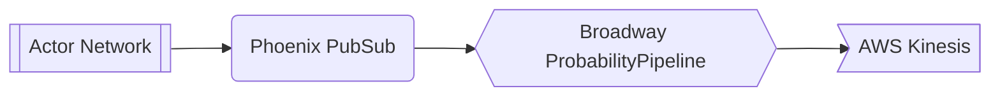
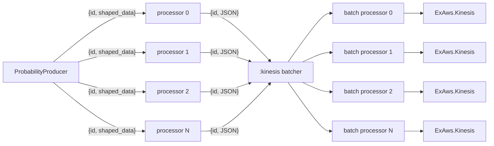

# Off-Broadway Offerings
> [!NOTE]
> ☝️ NB: This is *non*-proprietary framework code that I designed and implemented for a major provider in the online gambling space. The intent of this repository is to share techniques used for handling a real-time, low latency (compressed) TLS/TCP socket datastream and how to establish an actor network for *reactively* handling real-time datastream events.  You'll get the most value by comparing Kambi's specification to the respective Elixir code.  Of particular note:
> * The multi-step authentication process (detailed in [Transport](https://ctn-api.kambi.com/offering-gate/v1/docs/#/docs/protocol/transport)) is implemented in [connection.ex](lib/connection.ex) and diagrammed [here](#the-connection-component-a-gen_statem-state-machine).
> * Decoding of the wire format (detailed in [Message framing](https://ctn-api.kambi.com/offering-gate/v1/docs/#/docs/protocol/framing)) is implemented in [stream_handler.ex](lib/stream_handler.ex).
> * Establishing the real-time datastream (detailed in [Message Flow](https://ctn-api.kambi.com/offering-gate/v1/docs/#/docs/protocol/message_flow)) is implemented in [message_handler.ex](lib/message_handler.ex).
>
> The "magic" in this code comes from a novel use of [function captures](https://hexdocs.pm/elixir/1.12.3/Function.html#module-the-capture-operator).  Once the connection module retrieves the JWT and performs the TLS connection to assign the socket, it calls StreamHandler.init/1, providing that function with a *capture* of the MessageHandler.handle_message/2 function.  You'll notice that the first argument of that capture is a value placeholder, which is expected to be a "fully-baked" message.  The `StreamHandler.init/1` call returns with *another* function capture which encapsulates the provided `handle_message/2`.  This function capture also contains a value placeholder, this one expecting gzip compressed bytes straight from the socket.  The StreamHandler.init/1 return capture gets stored in the connection's state and we finally move onto consuming bytes from the socket.  Assuming bytes were retrieved, the connection's state's StreamHandler capture gets invoked with said bytes and the return value, another capture, gets stored back into the connection module's state before making another (recursive*ish*) call to consume socket data.  Assuming the StreamHandler capture invocation was able to identify a message, its encapsulated MessageHandler.handle_message/2 capture is invoked providing the message bytes.  The message bytes get pattern matched and if applicable, get published to the first Broadway pipeline and onward to the actor network.
>
>  Please feel free to reach out with any questions: <a href="mailto:andrew.oswald+off_broadway_offerings@gmail.com">Andrew Oswald</a>.

An [Elixir](https://elixir-lang.org/) ([off-broadway](https://hexdocs.pm/broadway/introduction.html#non-official-off-broadway-producers)) application that consumes a Kambi [Offering Replication API](https://ctn-api.kambi.com/offering-gate/v1/docs/#/docs/intro/overview) datastream and feeds it to a [Broadway](https://elixir-broadway.org/) pipeline.  The events are then processed by way of a dynamic actor network.

It is within the actor network where arbitrary, reactive business logic runs.

## Processing Internals
`off_broadway_offerings` is an [OTP](https://www.erlang.org/doc/design_principles/des_princ.html) application with numerous levels of supervision trees.  It's designed to be error resilient when applicable and to internally manage component isolation.  For a typical example, if we should experience a networking hiccup, the entire application will not grind to a halt, but rather, the connection will be reesatblished and the app will self-heal.  That said, there are several processing internals of note, as outlined below.

### The Connection component: a [gen_statem](https://www.erlang.org/doc/man/gen_statem.html) state machine
The ORA feed requires two steps to start the message stream, both of which needing client certs for authentication.  The first step is to retrieve a JWT followed by using said JWT to establish a TLS/TCP socket connection.  Once the socket connection has been established, the session gets initialized and the real-time offerings message stream starts.

#### Connection states

#### Disconnected state internals

#### Connected state internals

Once connected, [`rcv`](https://www.erlang.org/doc/apps/ssl/ssl.html#recv/3) calls on the socket with results of *packet* (ie, *data* from the socket buffer) or *timeout* are immediately followed by messaging the process itself to invoke another `consume` call.  This enables the module to be responsive to other messages it may have received in its mailbox (gen_statem is actually a gen_server abstraction).

### Broadway Message pipeline: reliably organizing the real-time ORA data stream
Identifying compressed message boundaries (and doing so performantly) is only part of the challenge of making use of this data feed.  It's been observed that despite TCP ordering guarantees, messages in the ORA feed are not guaranteed to arrive in a logical order.  I *am* confident at one point they were in order, but if you think about the context for which they're being generated, it starts to make more sense that the onus of organization is on the client.  I speculate that there's some sort of stability threshold required of an entity prior to it being shipped; said differently, if an entity is the subject of a barrage of updates, it simply doesn't make sense to ship it until that volatility has settled.  Meanwhile, more granular messages associated to the entity are not subject to the same constraints and are thusly sent over the wire to downstream clients (albeit with *higher* offset values, ie, logically out of order).  Fortunately for us, Broadway makes organizing all of this data rather simple.

Our sourcing of Broadway data is *slightly* unconventional with regard to what's typically described as its intended use-case, that of *pulling* data from sources.  Broadway producers, the *entry* point to Broadway pipelines, have an internal buffer that can have data *pushed* to; in this case, we push data to the `MessageProducer` from the `MessageHandler` (which, in turn, received data from the `StreamHandler`).  The `MessageProducer` maintains an internal state that is kept aware of what stage the messages being provided happen to be in: `snapshot` for bootstrap, `replay` when from an offset, and `realtime` when real-time; this extra meta information is passed along with the message in order to surface that bit in case downstream business logic would need it.  It's worthy of note that it's the `MessageHandler`'s responsibility to assign the current date-time prior to passing the data along to the `MessageProducer`.

The next stage *after* `producer` in a Broadway pipeline is that of `processor`.  Our processor configuration is the first stage to utilize concurrency.  It's got a very simple, but very important role of unmarshaling the message (from raw binary) and assigning the actor ID for which related messages will be batched.  The choice to unmarshal the messages in the processor was strategic: don't tie up the datastream consuming process with any unnecessary work, but rather distribute that work amongst the machine's cpu cores (ie, configured processor concurrency count).

Batching is the (*optional*) final stage of a Broadway pipeline and is where we logically dispatch in bulk for actor network processing (also making use of concurrency).  The `ProbabilityProcessor` receives batches of messages respective to an actor.  Its first duty is to sort the given messages by `offset`, thusly restoring logical order as presented in the entity models.  Once sorted, the actor messages are processed for create, update, and delete actions.  Batching gets triggered either by size or time threshold.

### Dynamic Actor network: reactive business logic by way of messaging
The `ProbabilityProcessor` can be thought of as a proxy to the actor network.  It relies heavily on the Elixir [Registry](https://hexdocs.pm/elixir/1.13/Registry.html) primitive and with the exception of create and delete handling, is entirely non-blocking. `Registry`'s design provides optimized lookup and assignment at the expense of *unregistering*, which [can be delayed](https://hexdocs.pm/elixir/1.13/Registry.html#module-registrations); we ensure unregistering by *tight-looping* a subsequent [lookup](https://hexdocs.pm/elixir/1.13/Registry.html#lookup/2), only returning once the call results in an empty value (in practice this takes place so quickly that it's unobservable, but Kambi will, on occasion, send deletes immediatly followed by creates for the same entity so ensuring delete is *required* in order to maintain proper actor state).

There are currently two types of actors in the network (both implemented as [GenServer](https://hexdocs.pm/elixir/1.13/GenServer.html)s): `Event` and `BetOffer`.  Per the message entity model, [Event](https://ctn-api.kambi.com/offering-gate/v1/docs/#/schemas/messages/event/event.json)s are *unaware* of their associated [BetOffer](https://ctn-api.kambi.com/offering-gate/v1/docs/#/schemas/messages/betOffer/betOffer.json)s and due to the async nature of the data stream, BetOffers *may* be processed in the system *prior to the actual existence* of their associated Event actors.  Fortunately for us, coordination of both scenarios isn't terribly difficult to deal with thanks again to strategic use of Elixir's `Registry`.  Relying on process instantiation on the [`BEAM`](https://en.wikipedia.org/wiki/BEAM_(Erlang_virtual_machine)) being atomic, both actor types' start sequences utilize a [`PubSub`](https://hexdocs.pm/elixir/1.13/Registry.html#module-using-as-a-pubsub) Registry feature.  Outlining the `BetOffer` sequence first will provide more context when looking at the `Event` starting sequence.

#### BetOffer actor initialization

That's quite a bit to unpack, but the particular things of note are:
* In its `init`, the BetOffer registers itself in the `PubSubReg` to receive notifications from its associated Event when *that* actor receives updates.
* The `init` callback response contains a `continue` instruction, which gets priority over any other messages that may have already arrived in the BetOffer's mailbox.
* The subsequent `handle_continue` *attempts* to retrieve the associated Event; if the event exists, pertinenat event attributes are stored in the BetOffer actor's state.

#### Event actor initialization

A couple similar concepts going on here, such as:
* In its `init`, Event responds with a `coninue` instruction so we don't block the calling process any longer than necessary.
* The subsequent `handle_continue` code invokes the `dispatch` function on the PubSubReg for which BetOffers have registered to receive Event updates.

Subsequent Event updates follow the same pattern of calling [`dispatch`](https://hexdocs.pm/elixir/1.13/Registry.html#dispatch/4) on the PubSubReg with an appropriate update lambda to keep all registered BetOffer actors aware of the changes.

### Probability pipeline: simple batching to AWS Kinesis
With the actor network established and reactively handling events, we're now equipped to surface data when business criteria is met.  The current latency requirements aren't too terribly urgent, so the natural choice was to publish to an AWS Kinesis stream.  Keep in mind, however, if needs for *lower* latency would be of competitive advantage, we have the opportunity for soft real-time by way of [Channel](https://hexdocs.pm/phoenix/channels.html)s.  Nevertheless, the `ProbabilityPipeline` sources its data similarly to the `MessagePipeline` by way of having data *pushed* to a producer.  This time it's slightly different though, with the `ProbabilityProducer` subscribing to a Phoenix [PubSub](https://hexdocs.pm/phoenix_pubsub/2.0.0/Phoenix.PubSub.html) topic.  When business criteria is met within an actor, said actor will simply publish shaped data to a pertinent PubSub topic, leaving consumers of the data to be largely framework agnostic (thus leaving the potential opportunity for Channels).

`ProbabilityPipeline` details:
* The processor is making use of concurrency and is responsible for marshaling the Elixir data terms to JSON.
* The batching, also making use of concurrency, is only concerned with optimizing batch uploads to Kinesis; the data does not need to be partitioned or assign processor affinity.

## License
This project's source code and documentation are licensed under the MIT license. See the [LICENSE](LICENSE) file for details.
